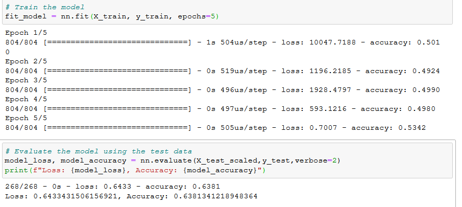

# Neural_Network_Charity_Analysis

Alphabet Soup's business team has some information Beks needs to create
a binary classifier to predict whether certain applicants will be
successful if they are monetarialy supported by their team. By using 
machine learning and neural networks Beks and I will analyze a large CSV 
to find which components led to an organization's success. 

The following variables are considered features for the model:

* EIN and NAME—Identification columns
* APPLICATION_TYPE—Alphabet Soup application type
* AFFILIATION—Affiliated sector of industry
* CLASSIFICATION—Government organization classification
* USE_CASE—Use case for funding
* ORGANIZATION—Organization type
* STATUS—Active status
* INCOME_AMT—Income classification
* SPECIAL_CONSIDERATIONS—Special consideration for application
* ASK_AMT—Funding amount requested
* IS_SUCCESSFUL—Was the money used effectively

These features were not needed:
* EIN and NAME—Identification columns

The focus of this analysis is targeted upon this column:
* IS_SUCCESSFUL—Was the money used effectively

For this project I used four dense hidden node layers at 24, 12, 10, and 5 saved at 5 epochs.

I found that increasing the number of layers reduced the accuracy percentage.
Through this model performance, the best accuracy I could achieve was still below 75% at about *64%.*
Many trials with increasing and decreasing nodes and layers as well as modifiying classification counts
 and replacing applications were taken. 

Overall my results from this model were close to the 75% accuracy goal, but still fell short.
My suggestion for a different model would to be modifying the epoch numbers or to 
elminate more columns from the original CSV file for a more concise database. 
